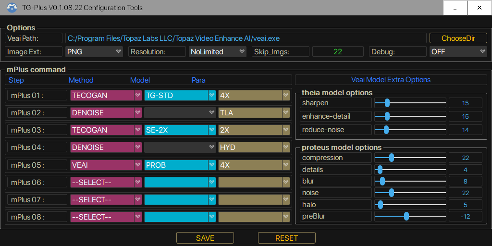

# JP109A_TG-PLUS
  
This is a tutorial to install and use the enhanced MOD for javplayer 109a, enhance the effect after removing mosaic.
This MOD was created by the Discord community kmkii#8701. 
If you can run the original javplayer, the mod should be easy to run as well. 
<pre><strong>I state this mod is completely free. Just for learning and communication purposes only. 
Do not use it for any commercial purposes.</strong> </pre>
### Console Interface
 
### Configuration Tools
 
## Changelogs：
#### TG-Plus_V0.1.08.22 Configuration Tools 
<pre>
Adapted to version V0.1.08.22. Other versions will report error. 
</pre>
#### TG-Plus for JP_109a v0.1.08.22 patch 
<pre>
Fixed skip_imgs bugs. Now can set resolution to NoLimited. 
</pre>
#### TG-Plus for JP_109a v0.1.08.20 
<pre>
<strong>Note. 
Because updated parameters, the old config.ini will not work need to deleted and re-generated.
</strong>
1.Add skip_imgs arg, skips se,denoise,downscale,veai steps, if the images less than skip_imgs.
  Please use with caution after testing.
2.Add veai_theia_model_opt and veai_proteus_model_opt args for custom Theia,Proteus models. 
  More detail refer to config.ini and the veai documentation.

 [veai_theia_model_opt]        #veai model thd, thf
  sharpen <0-100>             Amount of sharpening for output video [0-100] Defaults to 15.
  enhance-detail <0-100>      Amount of compression, affects the amount of detail that can be kept. [0-100]. Defaults to 50.
  reduce-noise <0-100>        Reduce noise. Values can be from 0 to 100. [0-100]. Defaults to 0.

 [veai_proteus_model_opt]      #veai model prob
  compression <0-100>         Revert Compression. Values can be from 0 to 100. [0-100]. Defaults to 0.
  details <0-100>             Recover Details. Values can be from 0 to 100. [0-100]. Defaults to 0.
  blur <0-100>                Sharpen. Values can be from 0 to 100. [0-100]. Defaults to 0.
  noise <0-100>               Reduce Noise. Values can be from 0 to 100. [0-100]. Defaults to 0.
  halo <0-100>                Dehalo. Values can be from 0 to 100. [0-100]. Defaults to 0.
  preBlur <-100-100>          Antialias / DeBlur. Values can be from 0 to 100. [-100-100]. Defaults to 0.

3.Add debug arg, ON used to display warning messages and troubleshoot such as inability to call GPU. 
4.Fixed SE-4X-R1 model.

</pre>
#### TG-Plus for JP_109a v0.1.08.09
<pre>
1. Only mPlus mode is supported now, other modes are discarded.
2. Abandoned esrgan and call.py extension mode.
3. The mod.ini is abandoned and the new configuration config.ini is used.
4. mPlus method is the same as before.
   usage: m1:tecogan:4:TG-STD
          m2:denoise:hyb
          ...
   please refer to config.ini.
5. Currently supported commands
   #1 tecogan usage tecogan:4:SE-4X
   model TG-STD TG-AF1 TG-8X SE-2X SE-4X ...
   #2 denoise denoise:tla
   method tla hyb td
   #3 downscale usage downscale:4  
   radio 2 4 
   #4 veai usage veai:4:ahq
   model ahq,alq,gcg....
6. No need to copy rename to tve, default installation of veai , the mod will automatically get parameters, 
   other locations please specify in the config.ini. Note that some versions of veai have problems, if you can't use it, 
   please check whether the model is available in the veai command line first.
7. You can choose jpg png image format now, but it will be converted to png before calling veai. veai does not support jpg :( .
8. No longer support the old SE-2X SE-4X TG-8X model, add new se-model SE-4X-R1.
   Will update the model if there was time.
9. Fix some bugs, rearranged the output information.
10. Optimize package remove some unused libraries.

Installation Instructions.
1. Please pay attention to backup.
2. Unzip it to JavPlayer_109a/TG/TGMAIN directory.
3. The configuration file is in the TG directory.
4. For some details, please refer to the old documentation.
</pre>

## Configuration:
Config.ini is generated automatically on first run. Refer to the old documentation to modify the running parameters.
<pre>
[main]
mode = TG-PLUS
debug = OFF

[mplus]
m1 = tecogan:4:TG-STD
m2 = denoise:tla
m3 = tecogan:4:SE-4X-R1
m4 = downscale:4
m5 = denoise:hyb
m6 = veai:4:prob
m7 = 
m8 = 
m9 = 
m10 = 

[others]
imgext = png
skip_imgs = 14
resolution = 1920

[veai]
veaipath = C:/Program Files/Topaz Labs LLC/Topaz Video Enhance AI/veai.exe

[veai_theia_model_opt]
sharpen = 15
enhance-detail = 50
reduce-noise = 0

[veai_proteus_model_opt]
compression = 52
details = 24
blur = 9
noise = 7
halo = 12
preblur = -19

[veaidict]
aaa = aaa-9
ahq = ahq-11
alq = alq-12
alqs = alqs-1
amq = amq-12
amqs = amqs-1
chr = chr-1
ddv = ddv-2
dtd = dtd-3
dtds = dtds-1
dtv = dtv-3
dtvs = dtvs-1
gcg = gcg-5
ghq = ghq-5
no = no-1
prap = prap-1
prob = prob-1
thd = thd-3
thf = thf-4
</pre>
## Update:
    passwd:km 
1. TG-PLUS_v0.1.08.20.rar (498.07 MB) 
Add veai_theia_model_opt and veai_proteus_model_opt args for custom Theia,Proteus models. 
https://workupload.com/file/UFstZpk5Byb
2. TG-Plus_v.0.1.08.22_patch.rar (114.70 KB) 
Fixed skip_imgs bugs. Now can set resolution to NoLimited. 
https://workupload.com/file/UFqXAyYqNTf
3. TG-Plus_V0.1.08.22_Configuration_Tools.rar (37.67 MB) 
Adapted to version V0.1.08.22. Other versions will report error. 
https://workupload.com/file/KFRw65Qnkzw 
4. Gpu issues. 
If encounter Gpu issues, unzip CUDA_Dlls.rar to tgmain directory. 
Cuda_dlls.rar (402.27 MB) 
https://workupload.com/file/2mtvdPw3v6B  
3000 series also need dlls_3.rar (331.79 MB) 
https://workupload.com/file/M69AEP26uXA  
5. Javplayer_watermark_patch 102-109a (6.06 MB) 
https://workupload.com/file/zWdsxcGAYtx 
## Old Tutorial.
The thup.work is out of service.I don't know when it will be back up. 
https://github.com/km2ii/JP109A_TG-PLUS/blob/main/README_OLD.md. 

