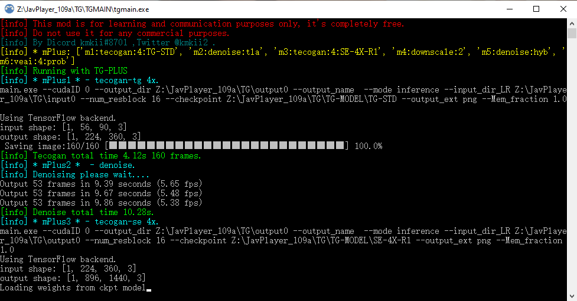

# JP109A_TG-PLUS
  
This is a tutorial to install and use the enhanced MOD for javplayer 109a, enhance the effect after removing mosaic.
This MOD was created by the Discord community kmkii#8701. 
If you can run the original javplayer, the mod should be easy to run as well. 
<pre><strong>I state this mod is completely free. Just for learning and communication purposes only. 
Do not use it for any commercial purposes.</strong> </pre>
 
## Changelogs：
<pre>
1. Only mPlus mode is supported now, other modes are discarded.
2. Abandoned esrgan and call.py extension mode.
3. The mod.ini is abandoned and the new configuration config.ini is used.
4. mPlus method is the same as before.
   usage: m1:tecogan:4:TG-STD
          m2:denoise:hyb
          ...
   please refer to config.ini.
5. Currently supported commands
   #1 tecogan usage tecogan:4:SE-4X
   model TG-STD TG-AF1 TG-8X SE-2X SE-4X ...
   #2 denoise denoise:tla
   method tla hyb td
   #3 downscale usage downscale:4  
   radio 2 4 
   #4 veai usage veai:4:ahq
   model ahq,alq,gcg....
6. No need to copy rename to tve, default installation of veai , the mod will automatically get parameters, 
   other locations please specify in the config.ini. Note that some versions of veai have problems, if you can't use it, 
   please check whether the model is available in the veai command line first.
7. You can choose jpg png image format now, but it will be converted to png before calling veai. veai does not support jpg :( .
8. No longer support the old SE-2X SE-4X TG-8X model, add new se-model SE-4X-R1.
   Will update the model if there was time.
9. Fix some bugs, rearranged the output information.
10. Optimize package remove some unused libraries.

Installation Instructions.
1. Please pay attention to backup.
2. Unzip it to JavPlayer_109a/TG/TGMAIN directory.
3. The configuration file is in the TG directory.
4. For some details, please refer to the old documentation.
</pre>

## Configuration:
Config.ini is generated automatically on first run. Refer to the old documentation to modify the running parameters.
<pre>
[main]
mode = TG-PLUS

[mplus]
m1 = tecogan:4:TG-STD
m2 = denoise:tla
m3 = tecogan:4:SE-4X-R1
m4 = downscale:2
m5 = denoise:hyb
m6 = veai:4:prob
m7 = 
m8 = 
m9 = 
m10 = 

[others]
imgext = png
crf = 22
resolution = 1920
veaipath = C:/Program Files/Topaz Labs LLC/Topaz Video Enhance AI/veai.exe

[veaidict]
aaa = aaa-9
ahq = ahq-11
alq = alq-12
alqs = alqs-1
amq = amq-12
amqs = amqs-1
chr = chr-1
ddv = ddv-2
dtd = dtd-3
dtds = dtds-1
dtv = dtv-3
dtvs = dtvs-1
gcg = gcg-5
ghq = ghq-5
no = no-1
prap = prap-1
prob = prob-1
thd = thd-3
thf = thf-4
</pre>
## Update:
1. TG-PLUS_v.1.08.12.rar (430.88 MB)  
https://workupload.com/file/xGmdZzsZmLp passwd:km 
Fix some bugs.
2. Cuda_dlls.rar (402.27 MB) 
If encounter Gpu issues, unzip CUDA_Dlls.rar to tgmain directory. 
https://workupload.com/file/2mtvdPw3v6B  
3. Javplayer_watermark_patch 102-109a (6.06 MB) 
https://workupload.com/file/zWdsxcGAYtx 
## Old Tutorial.
The thup.work is out of service.I don't know when it will be back up. 
https://github.com/km2ii/JP109A_TG-PLUS/blob/main/README_OLD.md. 

