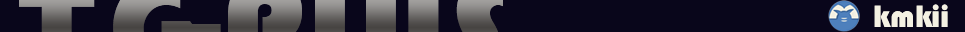
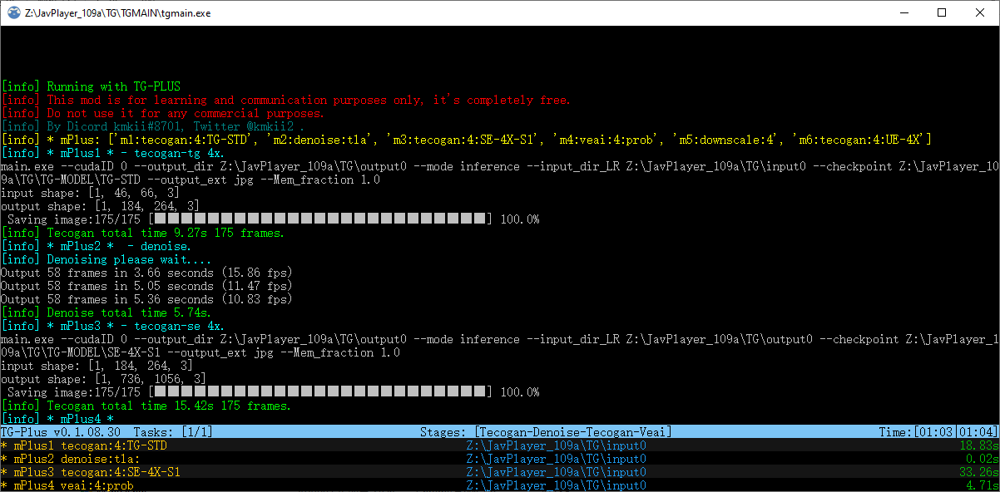
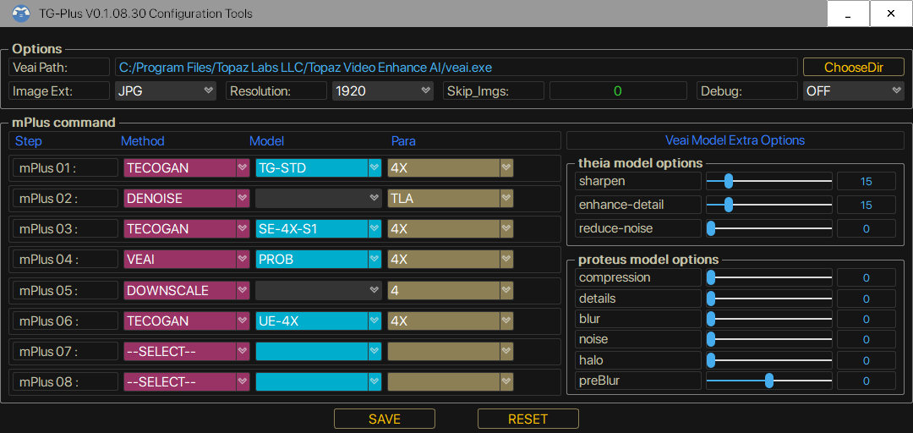

# JP109A_TG-PLUS
  
<pre><strong>I state this mod is completely free. Just for learning and communication purposes only. 
Do not use it for any commercial purposes.</strong> </pre>
   This is a tutorial to install and use the enhanced MOD for javplayer 109a, enhance the effect after removing mosaic.
This MOD was created by the Discord community kmkii#8701. 
If you can run the original javplayer, the mod should be easy to run as well. 

## Console Interface.
 
## Configuration Tools.
 
## Installation Instructions:
<pre>
1. The runtime environment is cuda11.1 cudnn8.1.1, Please install and configure it.
2. Unzip zipfile to JavPlayer_109a/TG/ directory.
3. Configuration file Config.ini will auto-generated on first run.
4. Optional Topaz Video Enhance AI, Use the default installation path to get veai parameters. 
   If installed elsewhere please specify the directory where veai is located in config.ini or use ConfigTools. 
   Unfortunately the CLI has been removed from 2.4.0. So please wait for the veai update or continue with 2.3.0.
5. For some details, please refer to the old documentation. 
</pre>
## Changelogs.
    passwd:km 
### <strong>TG-Plus for JP_109a v0.1.08.30b </strong> (551.12 MB)
https://workupload.com/file/NU45mZrGdNg
<pre>
1. Update the console interface show more information about tasks.
2. Update model SE-4X-S1, sharper comparison with SE-4X.
3. NEW ue-model UE-4X, for detail enhancement of effects after SE or veai.
  The usual usage. 
   a. tg-se-ue 
   b. tg-veai-ue 
   c. tg-se-veai-ue 
  Note:  
   After tg-se-veai multiple upscales, the UE should be preceded by a downscale:4, to prevent out-of-memory errors. 
   For UE models, the denoise function is recommended for use after tg only, That will save a lot of time. 
4. Update ConfigTools V0.1.08.30 adapted to new models. 
5. Update some usage examples. 
6. Fixed a few bugs.
</pre>

### History Changelogs.
#### TG-Plus for JP_109a v0.1.08.20 
<pre>
<strong>Note. 
Because updated parameters, the old config.ini will not work need to deleted and re-generated.
</strong>
1.Add skip_imgs arg, skips se,denoise,downscale,veai steps, if the images less than skip_imgs.
  Please use with caution after testing.
2.Add veai_theia_model_opt and veai_proteus_model_opt args for custom Theia,Proteus models. 
  More detail refer to config.ini and the veai documentation.

 [veai_theia_model_opt]        #veai model thd, thf
  sharpen <0-100>             Amount of sharpening for output video [0-100] Defaults to 15.
  enhance-detail <0-100>      Amount of compression, affects the amount of detail that can be kept. [0-100]. Defaults to 50.
  reduce-noise <0-100>        Reduce noise. Values can be from 0 to 100. [0-100]. Defaults to 0.

 [veai_proteus_model_opt]      #veai model prob
  compression <0-100>         Revert Compression. Values can be from 0 to 100. [0-100]. Defaults to 0.
  details <0-100>             Recover Details. Values can be from 0 to 100. [0-100]. Defaults to 0.
  blur <0-100>                Sharpen. Values can be from 0 to 100. [0-100]. Defaults to 0.
  noise <0-100>               Reduce Noise. Values can be from 0 to 100. [0-100]. Defaults to 0.
  halo <0-100>                Dehalo. Values can be from 0 to 100. [0-100]. Defaults to 0.
  preBlur <-100-100>          Antialias / DeBlur. Values can be from 0 to 100. [-100-100]. Defaults to 0.

3.Add debug arg, ON used to display warning messages and troubleshoot such as inability to call GPU. 
4.Fixed SE-4X-R1 model.
</pre>

#### TG-Plus for JP_109a v0.1.08.09
<pre>
1. Only mPlus mode is supported now, other modes are discarded.
2. Abandoned esrgan and call.py extension mode.
3. The mod.ini is abandoned and the new configuration config.ini is used.
4. mPlus method is the same as before.
   usage: m1:tecogan:4:TG-STD
          m2:denoise:hyb
          ...
   please refer to config.ini.
5. Currently supported commands
   #1 tecogan usage tecogan:4:SE-4X
   model TG-STD TG-AF1 TG-8X SE-2X SE-4X ...
   #2 denoise denoise:tla
   method tla hyb td
   #3 downscale usage downscale:4  
   radio 2 4 
   #4 veai usage veai:4:ahq
   model ahq,alq,gcg....
6. No need to copy rename to tve, default installation of veai , the mod will automatically get parameters, 
   other locations please specify in the config.ini. Note that some versions of veai have problems, if you can't use it, 
   please check whether the model is available in the veai command line first.
7. You can choose jpg png image format now, but it will be converted to png before calling veai. veai does not support jpg :( .
8. No longer support the old SE-2X SE-4X TG-8X model, add new se-model SE-4X-R1.
   Will update the model if there was time.
9. Fix some bugs, rearranged the output information.
10. Optimize package remove some unused libraries.
</pre>
### Configuration.
#### config.ini
<pre>
[main]
mode = TG-PLUS
debug = OFF

[mplus]
m1 = tecogan:4:TG-STD
m2 = denoise:tla
m3 = tecogan:4:SE-4X-S1
m4 = veai:4:prob
m5 = downscale:4
m6 = tecogan:4:UE-4X
m7 = 
m8 = 
m9 = 
m10 = 

[others]
imgext = png
skip_imgs = 14
resolution = 1920

[veai]
veaipath = C:/Program Files/Topaz Labs LLC/Topaz Video Enhance AI/veai.exe

[veai_theia_model_opt]
sharpen = 15
enhance-detail = 50
reduce-noise = 0

[veai_proteus_model_opt]
compression = 52
details = 24
blur = 9
noise = 7
halo = 12
preblur = -19

[veaidict]
...
</pre>

### Additional tools.
#### JP_109A Video Quality Patch (5.81 MB) 
https://workupload.com/file/4eEWkJKh8zL  
<pre>
Add config.ini parameter crf to improve the quality of video in javplayer <strong>safe mode</strong>.
The default value is 22, reduce this value will improve the quality, please refer to ffmpeg settings for details.

Usage:
1. Rename ffmpeg.exe to ffmpeg1.exe, copy this tool to javplayer home directory.
2. Modify the TG/config.ini file, add a line crf = 22 in [others] parts, no modification will use the default value 22.
3. This tool can be used to add a watermark to the generated video, put watermark image logo.png into the TG directory.
   Watermark image will be randomly added to top left or bottom right corner of the video.
</pre>
## Others.
1. If encounter Gpu issues, unzip CUDA_Dlls.rar (402.27 MB) to tgmain directory. 
https://workupload.com/file/2mtvdPw3v6B  
2. IF you use 3000 series also need dlls_3.rar (331.79 MB) 
https://workupload.com/file/M69AEP26uXA  
3. Javplayer_watermark_patch 102-109a (6.06 MB) 
https://workupload.com/file/zWdsxcGAYtx 

## Integrity.
TG-Plus_V0.1.08.30
<pre><strong>TGMAIN/tgmain.exe MD5:9189ccf8251ead6322f23bf7cf637ff8
TGMAIN/main.exe   MD5:a9677df6af86300802d7bcde7f6b8a1e
TGMAIN/runGan.exe MD5:4e3fd07d9372815f2e8fd1c78655232c</strong></pre>

## Old Tutorial.
https://github.com/km2ii/JP109A_TG-PLUS/blob/main/README_OLD.md. 
The thup.work is out of service.I don't know when it will be back up. 
For reference only no need to download links in this document. 

<pre><strong>Please note that there are people faking author to sell old version on youtube and gumroad, 
Beware of being cheated!!!</strong></pre>

